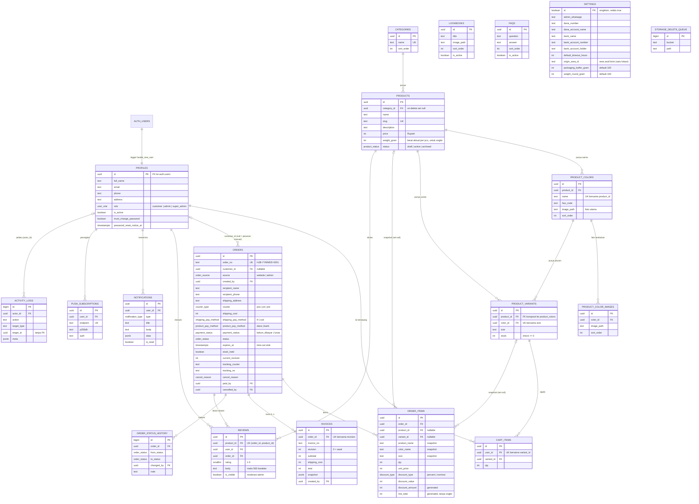
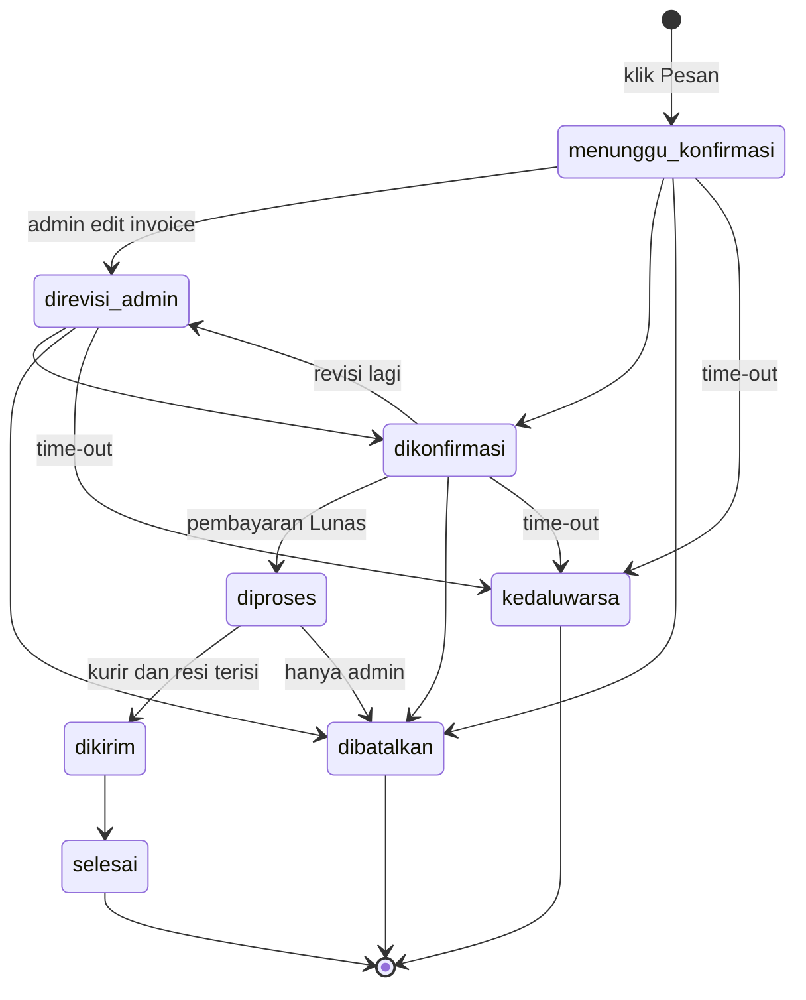

# ERD Hijabii by Intan (V1)

Acuan: `schema.sql`, PRD v1.2, `fitur.md`, `rulesapp.md`.
Database: Supabase (PostgreSQL 15+). Total 19 tabel + 3 view + 1 tabel bawaan Supabase (`auth.users`).

Legenda: `PK` primary key, `FK` foreign key, `UK` unique. Kolom yang ditampilkan adalah kolom kunci dan kolom penting. Daftar lengkap kolom ada di `schema.sql`.

---

## 1. Diagram Lengkap

---

## 2. Ringkasan Relasi

| Dari | Ke | Kardinalitas | Keterangan |
|---|---|---|---|
| `auth.users` | `profiles` | 1 : 1 | Profil dibuat otomatis oleh trigger `handle_new_user`, role default `customer`. Hapus user menghapus profil (cascade). |
| `categories` | `products` | 1 : 0..n | `on delete set null`. |
| `products` | `product_colors` | 1 : n | Cascade. `unique (product_id, name)`. |
| `product_colors` | `product_color_images` | 1 : n | Foto tambahan opsional. Cascade. |
| `product_colors` | `product_variants` | 1 : n | FK komposit `(color_id, product_id)` menjamin varian tidak bisa menunjuk warna milik produk lain. `unique (color_id, size)`. |
| `products` | `product_variants` | 1 : n | Lewat FK komposit di atas. |
| `profiles` | `cart_items` | 1 : n | `unique (user_id, variant_id)`. |
| `product_variants` | `cart_items` | 1 : n | Cascade. |
| `profiles` | `orders` | 1 : 0..n | Lewat `customer_id` (nullable). Pesanan manual admin: `customer_id` null, data penerima di kolom `recipient_*`. |
| `profiles` | `orders` | 1 : 0..n | Tiga relasi tambahan ke profil: `created_by`, `paid_by`, `cancelled_by` (semua `set null`). Tidak digambar agar diagram tetap terbaca. |
| `orders` | `order_items` | 1 : n | Cascade. Item menyimpan snapshot nama, warna, ukuran, harga. |
| `products` / `product_variants` | `order_items` | 1 : 0..n | `set null` bila produk atau varian dihapus, riwayat tetap utuh. |
| `orders` | `invoices` | 1 : n | `unique (order_id, revision)`. Revisi 0 = invoice awal. |
| `orders` | `order_status_history` | 1 : n | Ditulis trigger `orders_after_write`. |
| `orders` | `reviews` | 1 : n | `unique (order_id, product_id)`, satu ulasan per produk per pesanan. |
| `products` | `reviews` | 1 : n | Cascade. |
| `profiles` | `reviews` | 1 : n | Cascade. |
| `profiles` | `notifications` | 1 : n | Cascade. |
| `profiles` | `push_subscriptions` | 1 : n | Satu baris per perangkat (`endpoint` unik). |
| `profiles` | `activity_logs` | 1 : 0..n | Lewat `actor_id`, `set null`. `target_id` sengaja tanpa FK karena targetnya bisa beda tipe. |

Tabel tanpa relasi: `lookbooks`, `faqs`, `settings`, `storage_delete_queue`.

---

## 3. Enum

| Enum | Nilai |
|---|---|
| `user_role` | `customer`, `admin`, `super_admin` |
| `product_status` | `draft`, `active`, `archived` |
| `order_status` | `menunggu_konfirmasi`, `direvisi_admin`, `dikonfirmasi`, `diproses`, `dikirim`, `selesai`, `dibatalkan`, `kedaluwarsa` |
| `payment_status` | `belum_dibayar`, `lunas` (hanya pembayaran produk) |
| `courier_type` | `pos`, `jnt`, `jne` |
| `shipping_pay_method` | `tf`, `cod` (metode bayar ongkir) |
| `product_pay_method` | `dana`, `bank` (metode bayar produk) |
| `discount_type` | `percent`, `nominal` |
| `order_source` | `website`, `admin` |
| `cancel_reason` | `salah_pilih_produk`, `salah_alamat`, `berubah_pikiran`, `kedaluwarsa`, `dibatalkan_admin` |
| `notification_type` | `order_baru`, `invoice_direvisi`, `diproses`, `dikirim`, `dibatalkan_customer`, `dibatalkan_admin`, `kedaluwarsa`, `password_diubah` |

---

## 4. Alur Status Pesanan

Sesuai trigger `orders_before_update`.

---

## 5. View

| View | Fungsi | Catatan |
|---|---|---|
| `order_totals` | Total produk, total qty, dan grand total (dengan ongkir) per pesanan | `security_invoker`, mengikuti RLS pemanggil. |
| `product_reviews_public` | Ulasan yang tampil, dengan nama depan saja (`display_name`) | Hanya `is_visible = true`. Dibuka ke `anon` dan `authenticated`. |
| `product_rating_stats` | Rata-rata rating dan jumlah ulasan per produk | Hanya menghitung ulasan yang tampil. |

---

## 6. Function dan RPC Penting

| Function | Dipanggil oleh | Fungsi |
|---|---|---|
| `place_order` | Customer | Buat pesanan dari keranjang, harga dihitung server dari katalog, keranjang dibersihkan. |
| `admin_create_order` | Admin | Pesanan manual atau pre-order, boleh set harga dan diskon, tanpa akun customer. |
| `cancel_my_order` | Customer | Batal sebelum Diproses, wajib pilih alasan. |
| `revise_invoice` | Admin | Buat revisi invoice baru, status menjadi `direvisi_admin`. |
| `admin_extend_timeout` | Admin | Perpanjang `expires_at` per pesanan. |
| `expire_overdue_orders` | pg_cron (tiap 10 menit) | Ubah pesanan time-out jadi `kedaluwarsa`. Tidak bisa dipanggil dari API. |
| `report_orders`, `report_summary` | Admin, Super Admin | Laporan pesanan final, tanpa ongkir, alamat, dan nomor customer. |
| `clear_password_flags`, `dismiss_password_notice` | User | Tutup kewajiban ganti password dan banner. |
| `auth_role`, `is_admin`, `is_super_admin` | RLS | Helper pengecek peran (hanya akun aktif). |
| `can_review` | RLS `reviews_insert` | Pastikan pesanan milik sendiri, berstatus Selesai, dan berisi produk tersebut. |

---

## 7. Akses per Peran (RLS)

| Tabel | Customer | Admin | Super Admin |
|---|---|---|---|
| `profiles` | baca dan ubah diri sendiri | – | baca semua, ubah `is_active` akun lain |
| `categories`, `lookbooks`, `faqs` | baca | CRUD | baca |
| `products`, `product_colors`, `product_color_images`, `product_variants` | baca yang aktif | CRUD | baca yang aktif |
| `settings` | baca | ubah | baca |
| `cart_items` | CRUD milik sendiri | – | – |
| `orders`, `order_items`, `invoices`, `order_status_history` | baca milik sendiri | baca dan ubah semua | **tidak ada akses** |
| `reviews` | tulis, ubah, hapus milik sendiri | sembunyikan, tampilkan, hapus | – |
| `notifications` | baca dan tandai dibaca milik sendiri | idem | idem |
| `push_subscriptions` | CRUD milik sendiri | idem | idem |
| `activity_logs` | – | – | baca |
| `storage_delete_queue` | – | – | – (hanya `service_role`) |

Storage bucket `hijabii-images`: baca publik, tulis hanya admin, maks 2 MB, hanya `image/webp`.

---

## 8. Trigger Utama

| Trigger | Tabel | Fungsi |
|---|---|---|
| `on_auth_user_created` | `auth.users` | Buat profil otomatis. |
| `profiles_protect_trg` | `profiles` | Lindungi `role`, `id`, dan kolom sensitif dari perubahan klien. |
| `profiles_log_active_trg` | `profiles` | Catat aktivasi atau penonaktifan ke `activity_logs`. |
| `order_items_guard_trg` | `order_items` | Kunci stok saat item dibuat, sesuaikan saat qty diubah, kunci item setelah Diproses. |
| `orders_before_update_trg` | `orders` | Validasi transisi status, kunci data setelah Diproses, isi jejak waktu, kembalikan stok saat batal atau kedaluwarsa. |
| `orders_after_write_trg` | `orders` | Tulis riwayat status dan kirim notifikasi. |
| `invoices_after_insert_trg` | `invoices` | Notifikasi customer saat invoice direvisi (revisi ≥ 1). |
| `reviews_guard_trg` | `reviews` | Customer hanya ubah rating dan teks, admin hanya ubah `is_visible`. |
| `*_img_trg` | `product_colors`, `product_color_images`, `lookbooks` | Masukkan path foto lama ke `storage_delete_queue`. |
| `*_touch` | tabel ber-`updated_at` | Perbarui `updated_at` otomatis. |
