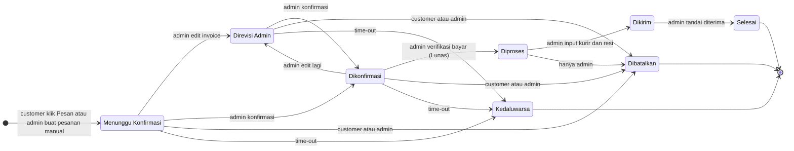
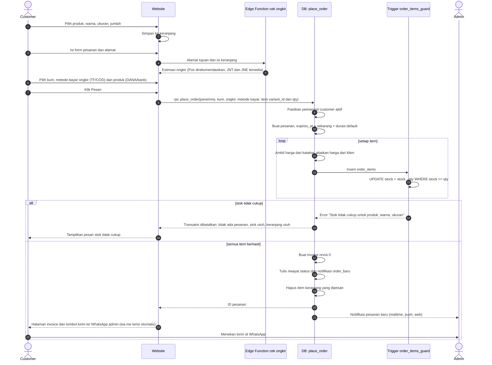
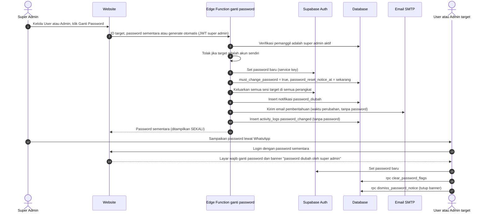
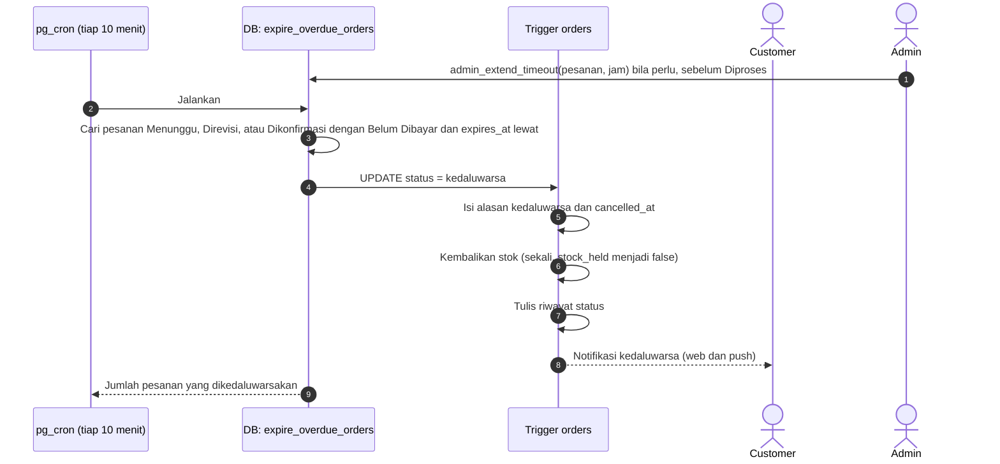

# Alur dan Status Pesanan — Hijabii by Intan (V1)

Acuan: `rulesapp.md`, `fitur.md`, `schema.sql` (trigger `orders_before_update`, `order_items_guard`, `orders_after_write`), `rls.sql` (RPC). Dokumen ini adalah versi yang bisa dibaca manusia dari aturan di database. Jika berbeda, **SQL yang berlaku**.

---

## 1. Diagram status pesanan

Catatan:
- Edit invoice berulang saat status sudah **Direvisi Admin** tidak mengubah status; hanya nomor revisi invoice yang bertambah.
- **Selesai**, **Dibatalkan**, dan **Kedaluwarsa** adalah status akhir. Pesanan Kedaluwarsa tidak bisa dihidupkan kembali (stok sudah dikembalikan); admin membuat pesanan manual baru.
- Data pesanan (item, harga, diskon, ongkir, metode bayar, status bayar) **terkunci** begitu status mencapai Diproses.

---

## 2. Siapa boleh mengubah status apa

Super Admin **tidak punya** akses mengubah status pesanan (tidak ada policy pada `orders`). Semua perubahan di bawah memakai RPC; admin secara teknis masih bisa `UPDATE` langsung ke `orders` lewat RLS, tetapi trigger `orders_before_update` tetap memvalidasi, dan RPC adalah jalur yang disarankan.

| Dari | Ke | Siapa | Fungsi | Syarat | Efek samping |
|---|---|---|---|---|---|
| (baru) | Menunggu Konfirmasi | Customer | `place_order` | Akun aktif ber-role customer, varian ada dan produk aktif, stok cukup | Stok terkunci, invoice revisi 0, `expires_at` = sekarang + durasi default, notifikasi `order_baru` ke semua admin aktif, item keranjang yang dipesan dihapus |
| (baru) | Menunggu Konfirmasi | Admin | `admin_create_order` | Stok cukup. Boleh menentukan harga satuan dan diskon sejak awal | Seperti di atas, tetapi tanpa akun customer, tanpa notifikasi ke customer, dan tidak bisa diulas. Notifikasi `order_baru` tetap terkirim ke admin |
| Menunggu / Direvisi / Dikonfirmasi | Direvisi Admin | Admin | `admin_edit_order` (atau `revise_invoice` tanpa mengubah data) | Belum Diproses | Selisih qty menyesuaikan stok, invoice revisi baru, notifikasi `invoice_direvisi` ke customer akun |
| Menunggu / Direvisi | Dikonfirmasi | Admin | `admin_confirm_order` | Status saat ini Menunggu Konfirmasi atau Direvisi Admin | Konfirmasi ke customer dilakukan admin lewat WhatsApp |
| Dikonfirmasi | Diproses | Admin | `admin_verify_payment` | Hanya dari Dikonfirmasi | `payment_status` menjadi Lunas dan status Diproses dalam satu langkah, `paid_at`, `paid_by`, `processed_at` terisi, data pesanan terkunci, notifikasi `diproses` |
| Diproses | Dikirim | Admin | `admin_ship_order` | Kurir dan nomor resi wajib terisi | `shipped_at` terisi, notifikasi `dikirim` memuat kurir dan resi |
| Dikirim | Selesai | Admin | `admin_complete_order` | Hanya dari Dikirim | `completed_at` terisi. Customer akun kini bisa memberi ulasan |
| Menunggu / Direvisi / Dikonfirmasi | Dibatalkan | Customer | `cancel_order` (alias `cancel_my_order`) | Pesanan miliknya sendiri, wajib pilih satu dari tiga alasan | Stok kembali, notifikasi `dibatalkan_customer` ke admin beserta alasan |
| Menunggu / Direvisi / Dikonfirmasi / **Diproses** | Dibatalkan | Admin | `cancel_order` | Catatan alasan wajib. Alasan tercatat `dibatalkan_admin` | Stok kembali, notifikasi `dibatalkan_admin` ke customer akun |
| Menunggu / Direvisi / Dikonfirmasi | Kedaluwarsa | Sistem | `expire_overdue_orders` (tiap 10 menit) | `expires_at` lewat dan pembayaran produk masih Belum Dibayar | Stok kembali, alasan `kedaluwarsa`, notifikasi `kedaluwarsa` ke customer akun |

Tiga alasan pembatalan oleh customer: `salah_pilih_produk`, `salah_alamat`, `berubah_pikiran`.

Aksi yang bukan perpindahan status:

| Aksi | Siapa | Fungsi | Syarat |
|---|---|---|---|
| Perpanjang time-out | Admin | `admin_extend_timeout` | Hanya sebelum Diproses. Menambah jam dari `expires_at` atau dari sekarang, mana yang lebih besar |

**Ditolak database** (tidak mungkin terjadi):
- Dari Selesai, Dibatalkan, atau Kedaluwarsa ke status mana pun.
- Customer membatalkan pesanan yang sudah Diproses atau Dikirim.
- Diproses tanpa pembayaran Lunas, atau melompati Dikonfirmasi.
- Dikirim tanpa kurir dan nomor resi.
- Edit item, harga, diskon, ongkir, atau metode bayar setelah Diproses.
- Perpanjang time-out setelah Diproses.
- Pembatalan oleh admin tanpa catatan alasan.

---

## 3. Sequence: customer memesan (stok terkunci)

Stok dikunci oleh trigger `order_items_guard` setiap kali baris item dimasukkan. Pengurangannya satu perintah atomik (`UPDATE ... WHERE stock >= qty`), sehingga dua pembeli yang berebut stok terakhir tidak mungkin sama-sama berhasil. Seluruh `place_order` berjalan dalam satu transaksi: bila satu item gagal, pesanan, item, dan kunci stok lainnya dibatalkan semua.

Catatan:
- Ongkir yang dikirim ke `place_order` berasal dari klien. Admin memverifikasinya lewat edit invoice sebelum Dikonfirmasi.
- Bila customer tidak menekan kirim di WhatsApp, pesanan tetap tersimpan dan muncul di dashboard admin.
- Pesanan manual (`admin_create_order`) memakai logika yang sama, kecuali tidak ada keranjang dan harga serta diskon boleh ditentukan admin.

---

## 4. Sequence: super admin mengganti password

Dijalankan lewat Edge Function karena butuh service key. Super admin tidak bisa mengubah kolom `must_change_password` atau `password_reset_notice_at` dari klien (dijaga trigger `profiles_protect`).

Catatan:
- Alternatif yang lebih aman: tombol **Kirim link reset**. Super admin tidak pernah mengetahui password dan hanya perlu dicatat di log aktivitas.
- Penguncian fitur selama `must_change_password` bernilai true saat ini hanya dijaga di sisi klien; database belum menolak RPC lain.
- Password tidak pernah ditulis ke log, `activity_logs`, atau respons selain satu kali di layar super admin.
- Bila email gagal terkirim, aksi tetap berhasil dan super admin memberi tahu user lewat WhatsApp.

---

## 5. Sequence: kedaluwarsa otomatis

Dijadwalkan lewat `pg_cron` setiap 10 menit (lihat catatan operasional di `schema.sql`). Pembaruan dilakukan satu perintah set-based; pengembalian stok dan notifikasi ditangani trigger `orders_before_update` dan `orders_after_write`.

Catatan:
- Pesanan manual admin tidak punya akun customer, jadi tidak ada notifikasi; stok tetap dikembalikan.
- Pesanan yang sudah Diproses tidak pernah kedaluwarsa.
- Di laporan, Kedaluwarsa dihitung sebagai Dibatalkan, dengan alasan `kedaluwarsa`.
- Perpanjangan harus dilakukan sebelum kedaluwarsa. Setelahnya, buat pesanan manual baru.

---

## 6. Titik di luar sistem (manual lewat WhatsApp)

| Kejadian | Pelaku | Catatan |
|---|---|---|
| Pesan terisi otomatis ke admin setelah klik Pesan | Customer menekan kirim | Pesanan tetap tersimpan walau WhatsApp tidak terkirim |
| Konfirmasi invoice final | Admin | Admin juga mengubah status menjadi Dikonfirmasi di sistem |
| Bukti bayar | Customer kirim, admin periksa | Tidak ada upload di website |
| Refund | Customer hubungi admin | Maksimal 2x24 jam sejak pesanan diterima, tanpa janji lama proses |
| Retur | Customer hubungi admin | 2x24 jam, hanya rusak, cacat, atau salah kirim, wajib video unboxing |
| Password sementara | Super admin kirim ke user | Ditampilkan sekali di layar |
