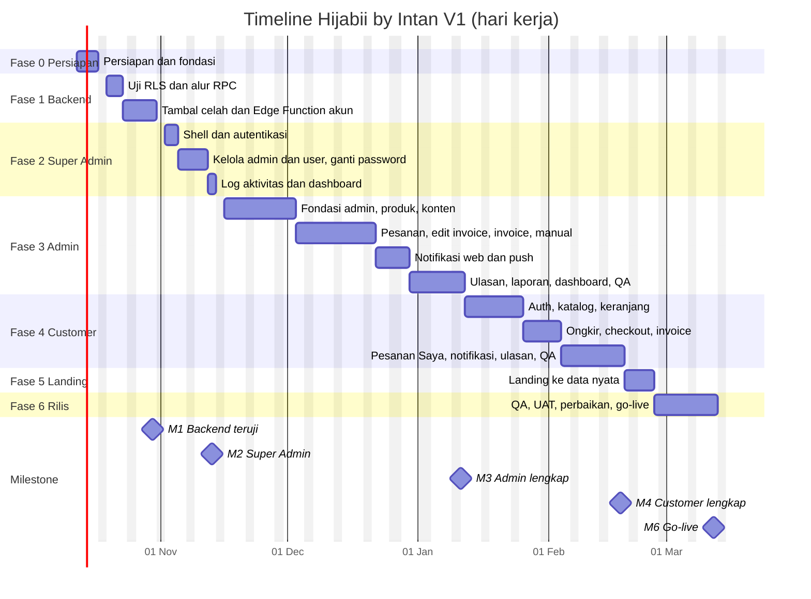

# timeline.md: Timeline Pengembangan Hijabii by Intan (V1)

Urutan pengerjaan: **backend → Super Admin → Admin → Customer → landing dan penyelesaian**. Disusun setelah membaca seluruh isi `HIJABII.zip`: `PRD_Website_Hijabii_v1_2.md`, `rulesapp.md`, `fitur.md`, `flows.md`, `erd.md`, `edge-functions.md`, `schema.sql`, `rls.sql`, `design.md`, dan paket desain Stitch.

Angka di dokumen ini adalah **estimasi**, bukan janji. Ketepatannya sekitar ±30%.

---

## 1. Ringkasan

| Hal | Nilai |
|---|---|
| Total pekerjaan | **108 hari kerja efektif** (≈ 21.6 minggu) |
| Mulai | Senin, 12 Okt 2026 |
| Go-live (jalur penuh) | ≈ **12 Mar 2027** |
| Kapasitas yang diasumsikan | 1 developer, 5 hari kerja efektif per minggu |
| Hari libur yang dikecualikan | 25 Des 2026 dan 1 Jan 2027 (libur nasional lain belum dihitung) |
| Batas waktu dari klien | Tidak ada (PRD bagian 16, no. 9) |
| Buffer | **Belum ada.** Tambahkan 10 sampai 15% (2 sampai 3 minggu) untuk jadwal yang dijanjikan ke klien |

### Milestone

| # | Milestone | Tanggal | Apa yang bisa didemokan ke klien |
|---|---|---|---|
| M1 | Backend teruji | 30 Okt 2026 | Belum ada tampilan. Hanya laporan uji akses dan alur status |
| M2 | Super Admin jalan | 13 Nov 2026 | Login, tambah admin, ganti password, nonaktifkan akun, log aktivitas |
| M3 | **Admin lengkap, mulai dipakai internal** | 11 Jan 2027 | Kelola produk, stok, pesanan, invoice, pembayaran, resi, laporan. Pesanan dari chat WhatsApp sudah bisa dicatat lewat pesanan manual |
| M4 | Customer lengkap (beta tertutup) | 18 Feb 2027 | Daftar, belanja, checkout, invoice, Pesanan Saya, ulasan |
| M5 | Landing terhubung data nyata | 25 Feb 2027 | Halaman publik memakai produk dan konten dari database |
| M6 | **Go-live** | 12 Mar 2027 | Domain, email, cron, backup, pelatihan admin |

---

## 2. Hasil membaca `HIJABII.zip`

| Berkas | Isi | Dipakai untuk |
|---|---|---|
| `PRD_Website_Hijabii_v1_2.md` | Tujuan, scope, peran, alur, aturan bisnis, laporan, notifikasi, yang belum diputuskan | Acuan scope |
| `rulesapp.md` | Aturan operasional lengkap: status, edit invoice, stok, time-out, bayar, ongkir (berat dan asal), batal, refund, retur, ulasan, hak akses, auth, notifikasi, laporan | Acuan aturan, menang atas PRD bila ada perbedaan kecil |
| `fitur.md` | Fitur per peran dan matriks akses | Daftar tugas |
| `schema.sql` | Tabel, enum, trigger, fungsi internal (`private.create_order`, `private.create_invoice`) | Fondasi database |
| `rls.sql` | RLS semua tabel, RPC customer/admin, view laporan, GRANT/REVOKE, pemeriksaan akhir. **Menimpa bagian 9 dan 10 di `schema.sql`** | Lapisan akses |
| `flows.md`, `erd.md` | Diagram status, urutan proses, relasi tabel | Acuan uji |
| `edge-functions.md` | Kontrak 7 pekerjaan server dan 6 hal yang belum berkontrak | Fase 1, 3, 4 |
| `design.md`, paket Stitch | Token, komponen, halaman per peran | Fase 0 dan seterusnya |

**Yang baru dibanding pencocokan sebelumnya (dari `rls.sql`, `rulesapp.md`, `edge-functions.md`):**

1. `admin_edit_order` sudah ada: ubah item, ongkir, dan kurir lalu buat revisi dalam **satu transaksi**. Celah "edit invoice tidak atomik" sudah tertutup.
2. Alur status admin punya RPC sendiri: `admin_confirm_order`, `admin_verify_payment`, `admin_ship_order`, `admin_complete_order`. Pembatalan satu pintu lewat `cancel_order` (customer dan admin).
3. Laporan lewat view `report_lines` berhak pemilik view, sehingga **super admin bisa membaca laporan tanpa akses ke tabel `orders`**.
4. Fallback ongkir sudah diputuskan: bila API gagal atau asal kirim kosong, pesanan tetap dibuat dengan ongkir 0 dan admin mengisinya di invoice. Artinya **sistem bisa berjalan tanpa API ongkir**.
5. Ukuran foto: sisi terpanjang **1200 px** (bukan 1600 px). `design.md` sudah diperbaiki.

**Masih terbuka (menjadi keputusan di bagian 6):** pre-order dengan stok 0 masih ditolak database, super admin masih bisa membaca `phone` dan `address` di `profiles`, `revoke_user_sessions` belum ada, `must_change_password` belum dijaga di RPC, empat kontrak Edge Function belum ditulis, API ongkir dan SMTP belum dipilih, dan peta URL halaman untuk push belum ada.

---

## 3. Mengapa urutannya begini

1. **Backend dulu.** Aturan bisnis (status, stok, penguncian, hak akses) hidup di trigger, RPC, dan RLS. Antarmuka hanya memanggilnya. Bila database salah, semua layar di atasnya ikut salah, jadi diuji lebih dulu.
2. **Super Admin kedua.** Akun admin hanya bisa dibuat super admin (`admin-create`). Selesai di sini, akun admin untuk pengujian sudah ada, dan shell login, reset password, serta wajib ganti password terbangun sekali untuk semua peran. Lingkupnya kecil dan tidak bergantung pada katalog.
3. **Admin ketiga.** Admin memegang data yang dibutuhkan customer: produk, varian, stok, foto, pengaturan pembayaran. Lewat pesanan manual, seluruh alur dari invoice sampai Selesai bisa diuji **tanpa** sisi customer. Hasilnya sudah berguna untuk dipakai internal (M3).
4. **Customer keempat.** Katalog, checkout, dan Pesanan Saya baru bermakna bila data dan alur admin sudah ada. Fitur yang butuh pihak ketiga (ongkir) dikerjakan di sini karena fallback membuatnya tidak memblokir.
5. **Landing terakhir.** `index.html` sudah jadi dan memakai `CONFIG` statis. Menyambungkannya ke database paling aman setelah datanya nyata.

Dua pengecualian dari urutan murni: laporan super admin dibangun sekali bersama laporan admin (3.13), dan komponen notifikasi dibangun di admin lalu dipakai ulang di customer.

---

## 4. Gantt



---

## 5. Rincian per fase

### Fase 0: Persiapan dan Fondasi

**12 Okt 2026 sampai 16 Okt 2026** · 5 hari kerja

Tujuan: Semua alat siap dan keputusan awal diambil.

| No | Pekerjaan | Hari | Jadwal | Catatan |
|---|---|:--:|---|---|
| 0.1 | Buat project Supabase, repo GitHub, project Vercel, env var. Simpan key di tempat aman. Lalu jalankan `schema.sql` dan `rls.sql`, pastikan pemeriksaan akhir RLS lulus dan bucket `hijabii-images` ada | 1 | 12 Okt | Key service role tidak boleh masuk repo |
| 0.3 | Cek kuota Supabase gratis terbaru, uji akun API ongkir (apakah Kantor Pos didukung), tentukan kandidat SMTP | 1 | 13 Okt | Keputusan 1, 2, 3 di bagian 6 |
| 0.4 | Fondasi frontend: struktur folder, token CSS/Tailwind dari `design.md`, klien Supabase, penjaga login dan peran, pemetaan status ke label, komponen dasar (tombol, input, badge, toast, modal/sheet, skeleton) | 2 | 14 Okt sampai 15 Okt | Dipakai ulang oleh semua peran |
| 0.5 | Akun super admin pertama lewat SQL Editor, data contoh (2 kategori, 2 produk, varian), catat langkahnya | 1 | 16 Okt | Satu-satunya akun yang dibuat manual |

**Selesai bila:** Skema ada di project baru dengan pemeriksaan RLS lulus. Satu halaman contoh berhasil login dan membaca `settings` memakai token desain.

### Fase 1: Backend

**19 Okt 2026 sampai 30 Okt 2026** · 10 hari kerja

Tujuan: Database dan fungsi server terbukti benar sebelum ada layar.

| No | Pekerjaan | Hari | Jadwal | Catatan |
|---|---|:--:|---|---|
| 1.1 | Uji RLS per peran (anon, customer, admin, super admin) dengan skrip SQL sesuai matriks akses di `erd.md` bagian 7 | 2 | 19 Okt sampai 20 Okt | Super admin tidak boleh membaca `orders` |
| 1.2 | Uji alur RPC dan trigger: `place_order`, `admin_edit_order`, `admin_confirm_order`, `admin_verify_payment`, `admin_ship_order`, `admin_complete_order`, `cancel_order`, `expire_overdue_orders`, rebutan stok terakhir, `report_orders` | 2 | 21 Okt sampai 22 Okt | Alur status dan penguncian data |
| 1.3 | Tambal celah schema sesuai keputusan: pre-order stok 0, view daftar user tanpa phone/address, `revoke_user_sessions`, penegakan `must_change_password` di RPC | 1 | 23 Okt | Keputusan 4, 5, 6, 7 |
| 1.4 | Kode bersama Edge Function: `requireRole`, CORS, format respons, validasi input, batas laju | 1 | 26 Okt | `supabase/functions/_shared/` |
| 1.5 | Tulis kontrak yang belum ada, lalu bangun `admin-create`, `admin-set-password`, `send-reset-link`, `account-set-active`, `admin-delete` | 3 | 27 Okt sampai 29 Okt | Kontrak di `edge-functions.md` bagian 1 yang belum ada |
| 1.6 | `pg_cron` kedaluwarsa tiap 10 menit, keepalive GitHub Actions, SMTP di Supabase Auth dan templat email berbahasa Indonesia | 1 | 30 Okt | Butuh keputusan SMTP |

**Selesai bila:** Skrip uji untuk 4 peran lulus semua. Alur status dari Menunggu sampai Selesai dan semua penolakan di `flows.md` bagian 2 teruji. Dua pembeli berebut stok terakhir: hanya satu berhasil. Lima Edge Function akun memberi respons sesuai kontrak dan tidak pernah menulis password ke log.

### Fase 2: Super Admin

**2 Nov 2026 sampai 13 Nov 2026** · 10 hari kerja

Tujuan: Pemilik brand bisa mengelola akun tanpa menyentuh data toko.

| No | Pekerjaan | Hari | Jadwal | Catatan |
|---|---|:--:|---|---|
| 2.1 | Shell dan autentikasi: login, logout, lupa dan reset password, layar wajib ganti password, banner password diubah, pengarah berdasarkan peran | 3 | 2 Nov sampai 4 Nov | Dipakai juga oleh admin dan customer |
| 2.2 | Kelola Admin: daftar, tambah (password sementara tampil sekali), nonaktifkan/aktifkan, hapus | 2 | 5 Nov sampai 6 Nov | `admin-create`, `account-set-active`, `admin-delete` |
| 2.3 | Kelola User: daftar dan cari, nonaktifkan. Ganti password (manual/generate, tampil sekali, tombol WhatsApp) dan Kirim Link Reset | 3 | 9 Nov sampai 11 Nov | Tidak berlaku untuk akun sendiri |
| 2.4 | Log Aktivitas (pelaku, aksi, target, waktu; tanpa password) | 1 | 12 Nov | Hanya baca |
| 2.5 | Dashboard ringkas, uji bahwa super admin tidak bisa menyentuh produk dan pesanan, buat satu akun admin cadangan | 1 | 13 Nov | Laporan super admin dibangun di 3.13 |

**Selesai bila:** Super admin membuat admin dan menerima password sementara satu kali. Akun target dipaksa ganti password. Penonaktifan langsung memutus akses. Super admin ditolak saat membuka produk atau pesanan.

### Fase 3: Admin

**16 Nov 2026 sampai 11 Jan 2027** · 39 hari kerja

Tujuan: Admin menjalankan toko sehari-hari.

| No | Pekerjaan | Hari | Jadwal | Catatan |
|---|---|:--:|---|---|
| 3.1 | Shell admin (sidebar 240px, rail 64px, bottom nav 4 slot dengan Lainnya) dan Pengaturan (WhatsApp, DANA, rekening, time-out, asal kirim) | 3 | 16 Nov sampai 18 Nov | Asal kirim diisi manual dulu, pemilih area menyusul di 4.4 |
| 3.2 | Komponen unggah foto (kompres WebP, sisi terpanjang 1200 px, maks 2 MB, pratinjau, progres) dan CRUD kategori | 2 | 19 Nov sampai 20 Nov | Dipakai produk, warna, lookbook |
| 3.3 | Produk: daftar, form (berat gram wajib), editor varian (warna dan foto, ukuran, matriks stok), status draft/aktif/arsip | 5 | 23 Nov sampai 27 Nov | Bagian paling kompleks di admin |
| 3.4 | CRUD Lookbook dan FAQ | 2 | 30 Nov sampai 1 Des |  |
| 3.5 | Fungsi penghapus file Storage dari `storage_delete_queue` (terjadwal) | 1 | 2 Des | Kontrak belum ada |
| 3.6 | Pesanan: daftar (filter status, tabel jadi kartu di mobile), detail, aksi status (konfirmasi, verifikasi bayar, kirim dengan resi, selesai, batal dengan catatan) | 5 | 3 Des sampai 9 Des | Satu RPC per aksi |
| 3.7 | Edit invoice lewat `admin_edit_order` dan perpanjang time-out | 3 | 10 Des sampai 14 Des | Peringatan saat status Dikonfirmasi kembali ke Direvisi Admin |
| 3.8 | Invoice: tampilan, riwayat revisi, unduh PDF, pesan `wa.me` konfirmasi ke customer | 2 | 15 Des sampai 16 Des | Ongkir hanya tampil di invoice |
| 3.9 | Pesanan manual lewat `admin_create_order` (harga dan diskon per item), termasuk tambah produk baru dari form | 3 | 17 Des sampai 21 Des | Memungkinkan seluruh alur diuji tanpa sisi customer |
| 3.10 | Notifikasi di web: lonceng realtime, daftar, tandai dibaca | 2 | 22 Des sampai 23 Des | Jalur utama di semua perangkat |
| 3.11 | Web Push: PWA manifest dan service worker, langganan perangkat, `send-push` dan Database Webhook, petunjuk iOS | 3 | 24 Des sampai 29 Des | Butuh peta URL halaman (keputusan 9) |
| 3.12 | Moderasi ulasan (sembunyikan/tampilkan/hapus) | 1 | 30 Des | Uji dengan ulasan dari pesanan contoh |
| 3.13 | Laporan: filter, ringkasan, tabel, export Excel dan PDF. Halaman yang sama dipakai super admin tanpa alamat dan nomor | 3 | 31 Des sampai 5 Jan | `report_orders`, `report_summary`, `report_period` |
| 3.14 | Dashboard admin: statistik, status stok, pesanan terbaru, aksi cepat | 2 | 6 Jan sampai 7 Jan |  |
| 3.15 | QA admin: pesanan manual dari awal sampai Selesai, batal, kedaluwarsa, laporan, lalu perbaikan | 2 | 8 Jan sampai 11 Jan | Hasilnya jadi M3 |

**Selesai bila:** Satu pesanan manual berjalan penuh: dibuat, direvisi, dikonfirmasi, dilunasi, dikirim dengan resi, selesai. Stok berubah benar di tiap langkah. Laporan sesuai nilai pesanan dan tidak menampilkan ongkir. Foto terunggah sebagai WebP kurang dari 2 MB dan file lama terhapus saat diganti.

### Fase 4: Customer

**12 Jan 2027 sampai 18 Feb 2027** · 28 hari kerja

Tujuan: Customer bisa belanja dari awal sampai ulasan.

| No | Pekerjaan | Hari | Jadwal | Catatan |
|---|---|:--:|---|---|
| 4.1 | Autentikasi customer: daftar, login, lupa password, profil dan alamat, wajib ganti password | 3 | 12 Jan sampai 14 Jan | Memakai shell dari 2.1 |
| 4.2 | Katalog per kategori, detail produk, pemilih warna (foto) dan ukuran, stok per varian, rating dan ulasan tampil | 5 | 15 Jan sampai 21 Jan | Hanya produk aktif |
| 4.3 | Keranjang (`cart_items`) dan validasi stok | 2 | 22 Jan sampai 25 Jan | Stok tidak dikunci di keranjang |
| 4.4 | Edge Function `cari-area` dan `cek-ongkir`; pasang pemilih area di Pengaturan admin | 2 | 26 Jan sampai 27 Jan | Butuh keputusan API ongkir. Berat kirim dihitung server |
| 4.5 | Checkout: data penerima, area, kurir (Pos direkomendasikan), metode bayar, `place_order`, penanganan stok habis dan fallback ongkir 0 | 4 | 28 Jan sampai 2 Feb | Nominal ongkir tidak tampil di checkout |
| 4.6 | Halaman sukses, invoice, tombol kirim WhatsApp ke admin, hitung mundur time-out | 1 | 3 Feb |  |
| 4.7 | Pesanan Saya: daftar, detail, timeline dari riwayat status, kurir dan resi, batal dengan alasan, lihat revisi invoice | 3 | 4 Feb sampai 8 Feb | Total di daftar = total produk tanpa ongkir |
| 4.8 | Notifikasi customer: lonceng realtime dan langganan push | 2 | 9 Feb sampai 10 Feb | Memakai komponen dari 3.10 dan 3.11 |
| 4.9 | Beri, ubah, dan hapus ulasan | 2 | 11 Feb sampai 12 Feb | Hanya untuk pesanan Selesai |
| 4.10 | Halaman Lookbook dan FAQ | 1 | 15 Feb |  |
| 4.11 | QA customer: pesan sampai selesai lalu ulasan, batal, kedaluwarsa, uji di ponsel dan iPhone | 3 | 16 Feb sampai 18 Feb | Hasilnya jadi M4 |

**Selesai bila:** Pesanan lewat website muncul di dashboard admin dalam hitungan detik beserta notifikasi. Stok habis memberi pesan jelas. Ongkir tidak tampil di checkout dan daftar pesanan, hanya di invoice. Customer tidak bisa membatalkan pesanan yang sudah Diproses.

### Fase 5: Landing dan Penyelesaian Tampilan

**19 Feb 2027 sampai 25 Feb 2027** · 5 hari kerja

Tujuan: Halaman publik memakai data nyata.

| No | Pekerjaan | Hari | Jadwal | Catatan |
|---|---|:--:|---|---|
| 5.1 | Hubungkan landing (`index.html`) ke data nyata: produk, warna, lookbook, FAQ, pengaturan. Ganti testimoni dummy dengan ulasan asli atau sembunyikan | 3 | 19 Feb sampai 23 Feb | `CONFIG` di landing diganti pembacaan Supabase |
| 5.2 | SEO dasar, meta dan OG, performa gambar (lazy-load), ikon PWA | 1 | 24 Feb |  |
| 5.3 | Konfirmasi dengan klien: akun TikTok (`@Hijabi_official` atau `@Hijabii_official`), logo, teks final | 1 | 25 Feb | Logo belum ada |

**Selesai bila:** Mengubah produk di admin langsung terlihat di landing. Tidak ada testimoni dummy yang tersisa.

### Fase 6: QA, UAT, dan Go-live

**26 Feb 2027 sampai 12 Mar 2027** · 11 hari kerja

Tujuan: Siap dipakai klien.

| No | Pekerjaan | Hari | Jadwal | Catatan |
|---|---|:--:|---|---|
| 6.1 | Uji keamanan akhir: RLS dengan akun nyata, service key tidak bocor, CORS, batas laju | 2 | 26 Feb sampai 1 Mar |  |
| 6.2 | Performa (katalog di bawah 3 detik di 4G) dan aksesibilitas | 2 | 2 Mar sampai 3 Mar |  |
| 6.3 | UAT dengan klien memakai skenario tertulis, catat revisi | 2 | 4 Mar sampai 5 Mar | Klien non-teknis: pakai skenario langkah demi langkah |
| 6.4 | Perbaikan hasil UAT | 2 | 8 Mar sampai 9 Mar |  |
| 6.5 | Isi konten awal (produk, foto, FAQ, lookbook), pelatihan admin, panduan singkat | 2 | 10 Mar sampai 11 Mar | Konten dari klien harus sudah ada |
| 6.6 | Go-live: domain, SMTP final, secrets produksi, cron, keepalive, backup terjadwal, pantau minggu pertama | 1 | 12 Mar |  |

**Selesai bila:** Skenario UAT lulus. Katalog terbuka di bawah 3 detik di 4G. Cron kedaluwarsa dan keepalive berjalan. Admin sudah dilatih dan memegang panduan singkat.

---

## 6. Keputusan yang harus diambil

Kolom "Paling lambat" dihitung dari tugas yang memblokir. Bila tidak ada keputusan, pakai nilai bawaan.

| # | Keputusan | Memblokir | Paling lambat | Bawaan bila tidak diputuskan |
|---|---|---|---|---|
| 1 | Kuota Supabase gratis terbaru (storage 500 MB atau 1 GB, egress) | Rencana foto dan keputusan R2 | 13 Okt | Tetap Supabase Storage, WebP 1200 px |
| 2 | API ongkir: Biteship atau Komerce (Kantor Pos harus didukung) | 4.4 `cari-area` dan `cek-ongkir` | 26 Jan 2027 | Biteship (condong di PRD). Bila Pos tidak didukung, Komerce. Tanpa keduanya, fallback ongkir 0 |
| 3 | Provider SMTP gratis | 1.6, 2.1 (email reset), `admin-set-password` | 30 Okt 2026 | Email bawaan Supabase hanya untuk pengembangan |
| 4 | Pre-order dengan stok 0: admin tambah stok dulu, atau database melewati cek stok untuk `source = 'admin'` | 1.3 dan 3.9 | 23 Okt 2026 | Admin tambah stok dulu (tanpa ubah schema) |
| 5 | Super admin boleh melihat `phone` dan `address` di daftar user, atau disembunyikan lewat view | 1.3 dan 2.3 | 23 Okt 2026 | Sembunyikan lewat view |
| 6 | Cara mengeluarkan sesi user lain: fungsi `revoke_user_sessions` atau setara | 1.5 (`admin-set-password`, `account-set-active`) | 27 Okt 2026 | Fungsi `revoke_user_sessions` hanya untuk `service_role` |
| 7 | `requireRole` dan RPC menolak akun `must_change_password` | 1.3 dan 1.4 | 26 Okt 2026 | Ya, tolak |
| 8 | Status Selesai: manual admin atau otomatis N hari setelah Dikirim | 3.6 | 3 Des 2026 | Manual admin (asumsi PRD 15.2) |
| 9 | Peta URL halaman (customer, admin, akun) untuk tautan push | 3.11 | 24 Des 2026 | Dibuat saat 3.1 dan disimpan di satu berkas rute |
| 10 | Domain | 6.6 (CORS `SITE_URL`, pengirim email, foto di R2) | 12 Mar 2027 | Subdomain Vercel |
| 11 | Isi awal: produk, varian, harga, foto, FAQ, lookbook, logo dari klien | 4.11, 5.1, 6.5 | 23 Nov 2026 | Data contoh dulu. Konten asli wajib sebelum 6.5 |
| 12 | Akun admin cadangan dengan email berbeda | 2.5 | 13 Nov 2026 | Dibuat di 2.5 |

---

## 7. Opsi mempercepat dan skala kapasitas

### 7.1 Bagian yang bisa ditunda ke rilis 1.1

Tidak ada yang mengubah aturan inti (status, stok, hak akses). Semuanya fitur pendukung.

| Ditunda | Hari hemat | Dampak |
|---|:--:|---|
| CRUD Lookbook dan FAQ (3.4, 4.10): isi lewat SQL atau tetap statis di landing | 3 | Admin belum bisa mengubah dua konten ini sendiri |
| Web Push (3.11 dan sebagian 4.8): hanya notifikasi di web | 3 | Notifikasi hanya muncul saat web dibuka |
| Rating dan ulasan (3.12, 4.9) | 3 | Detail produk tanpa rating |
| Export PDF laporan, hanya Excel | 1 | |
| Dashboard admin disederhanakan | 1 | Hanya daftar pesanan dan stok |
| Invoice dicetak lewat browser, bukan PDF buatan sendiri | 1 | |
| **Total** | **12** | Jalur MVP: 96 hari, selesai ≈ **24 Feb 2027** |

### 7.2 Bila kapasitas kurang dari 5 hari efektif per minggu

| Hari efektif per minggu | Durasi jalur penuh | Perkiraan go-live |
|:--:|---|---|
| 5 | ≈ 22 minggu | ≈ 12 Mar 2027 |
| 4 | ≈ 27 minggu | ≈ 19 Apr 2027 |
| 3 | ≈ 36 minggu | ≈ 21 Jun 2027 |

Pakai tabel ini bila ada pekerjaan lain berjalan bersamaan.

### 7.3 Catatan musim

Untuk brand hijab, permintaan biasanya naik menjelang Ramadan dan Lebaran. Perkiraan (cek kalender resmi): awal Ramadan sekitar 8 Februari 2027 dan Idulfitri sekitar 10 Maret 2027. Jalur penuh selesai sekitar Lebaran. Jalur MVP pun belum mendahului awal Ramadan.

Opsi yang realistis: **jangan menunggu go-live penuh.** Setelah M3 (admin lengkap, 11 Jan 2027), Hijabii sudah bisa memakai pesanan manual untuk mencatat pesanan WhatsApp, menerbitkan invoice, mengelola stok, dan melihat laporan. Itu memberi manfaat saat musim ramai, sementara sisi customer menyusul. Putuskan bersama klien setelah M2.

---

## 8. Risiko

| # | Risiko | Peluang | Dampak | Penanganan |
|---|---|:--:|:--:|---|
| 1 | Estimasi meleset, apalagi tanpa buffer | Tinggi | Sedang | Tinjau tiap Jumat: hari terpakai dibanding rencana. Bila meleset lebih dari 20% pada satu fase, turunkan item dari 7.1 |
| 2 | API ongkir tidak mendukung Kantor Pos atau kuota habis | Sedang | Rendah | Fallback ongkir 0 sudah diputuskan. Penggantian provider hanya menyentuh `_shared/shipping.ts` |
| 3 | Email (SMTP) gagal terkirim atau masuk spam | Sedang | Sedang | `admin-set-password` tetap berhasil dengan `mail_sent: false`. Sediakan tombol WhatsApp. Uji dengan akun email nyata di 1.6 |
| 4 | Supabase gratis jeda otomatis atau kuota penuh | Sedang | Tinggi | Keepalive mingguan (1.6). Pengingat bulanan. Foto dapat dipindah ke R2 bila bandwidth penuh |
| 5 | Push tidak jalan di iPhone | Tinggi | Rendah | Notifikasi di web selalu jadi jalur utama. Petunjuk "Tambahkan ke Layar Utama" di 3.11 |
| 6 | Konten dari klien terlambat (foto, harga, varian) | Tinggi | Sedang | Minta mulai Nov 2026 memakai templat isian. Pakai data contoh sampai konten datang |
| 7 | Klien non-teknis meminta perubahan besar di tengah jalan | Sedang | Tinggi | Demo di M2, M3, M4 dengan skenario tertulis. Bekukan scope V1 sesuai PRD. Permintaan baru masuk daftar rilis 1.1 |
| 8 | RLS atau kunci service salah sehingga data bocor | Rendah | Tinggi | Skrip uji 4 peran di 1.1, pemeriksaan tabel tanpa RLS di `rls.sql`, uji ulang di 6.1. Service key hanya di secrets Edge Function |
| 9 | Dua pembeli berebut stok | Rendah | Sedang | Pengurangan atomik di `order_items_guard`. Diuji di 1.2 |
| 10 | Pre-order stok 0 ditolak database | Tinggi | Sedang | Keputusan 4 di bagian 6. Bawaan: admin tambah stok dulu |
| 11 | Edit invoice pada pesanan Dikonfirmasi membatalkan konfirmasi tanpa disadari admin | Sedang | Rendah | Dialog peringatan di 3.7 dan penanda status jelas |

---

## 9. Struktur repo dan cara menguji

Usulan struktur (nama folder boleh diubah):

```
hijabii/
├─ supabase/
│  ├─ migrations/        001_schema.sql · 002_rls.sql · 003_patches.sql
│  ├─ functions/
│  │  ├─ _shared/        auth.ts · http.ts · shipping.ts
│  │  ├─ admin-create/ admin-set-password/ send-reset-link/
│  │  ├─ account-set-active/ admin-delete/ storage-cleanup/
│  │  └─ cari-area/ cek-ongkir/ send-push/
│  └─ tests/             rls_*.sql · flow_*.sql
├─ web/
│  ├─ index.html         landing
│  ├─ toko/              customer
│  ├─ admin/
│  ├─ superadmin/
│  └─ assets/            css · js · img
└─ .github/workflows/keepalive.yml
```

Perubahan database selalu lewat berkas migrasi baru (`003_patches.sql`, dst.), jangan mengedit `schema.sql` yang sudah dijalankan.

Cara uji:

- **Fase 1:** skrip SQL berjalan sebagai tiap peran (set `request.jwt.claims`) dan membandingkan hasil dengan matriks akses. Satu berkas per alur.
- **Fase 2 sampai 4:** setiap fase ditutup dengan QA berskenario (item terakhir di tiap fase). Skenario ditulis sebagai langkah yang bisa diulang klien saat UAT.
- **Fase 6:** uji ulang RLS dengan akun nyata dan jalankan skenario penuh di perangkat sungguhan (Android dan iPhone).

---

## 10. Checklist go-live

- [ ] Domain dan `SITE_URL` terpasang, CORS Edge Function hanya untuk domain itu
- [ ] SMTP final terpasang di Supabase Auth, templat reset password berbahasa Indonesia, uji kirim ke email nyata
- [ ] Secrets produksi (`SUPABASE_SERVICE_ROLE_KEY`, kunci API ongkir, `VAPID_*`, `PUSH_WEBHOOK_SECRET`) hanya di Edge Function, tidak ada di repo atau JavaScript browser
- [ ] `pg_cron` `expire-orders` aktif (tiap 10 menit) dan terlihat di `cron.job_run_details`
- [ ] Keepalive GitHub Actions berjalan, pengingat bulanan memeriksa status project
- [ ] Backup: export data terjadwal berkala dan disimpan di luar Supabase
- [ ] Database Webhook ke `send-push` aktif dengan header rahasia
- [ ] Super admin terdaftar (pemilik brand) dan satu admin cadangan dengan email berbeda
- [ ] Pengaturan terisi: WhatsApp admin, DANA, rekening bank, durasi time-out, asal kirim, buffer kemasan, pembulatan berat
- [ ] Tabel tanpa RLS = 0 (pemeriksaan akhir `rls.sql` lulus di produksi)
- [ ] Satu pesanan uji penuh di produksi: pesan, revisi, konfirmasi, lunas, kirim, selesai, ulasan
- [ ] Admin sudah dilatih dan memegang panduan singkat (cara memverifikasi pembayaran, edit invoice, input resi, batal, laporan)
- [ ] Testimoni dummy di landing sudah diganti atau disembunyikan
